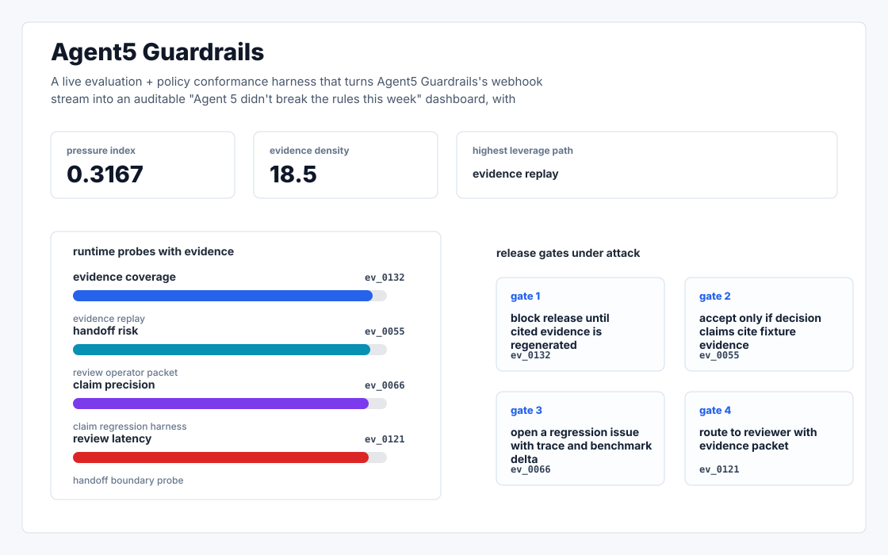
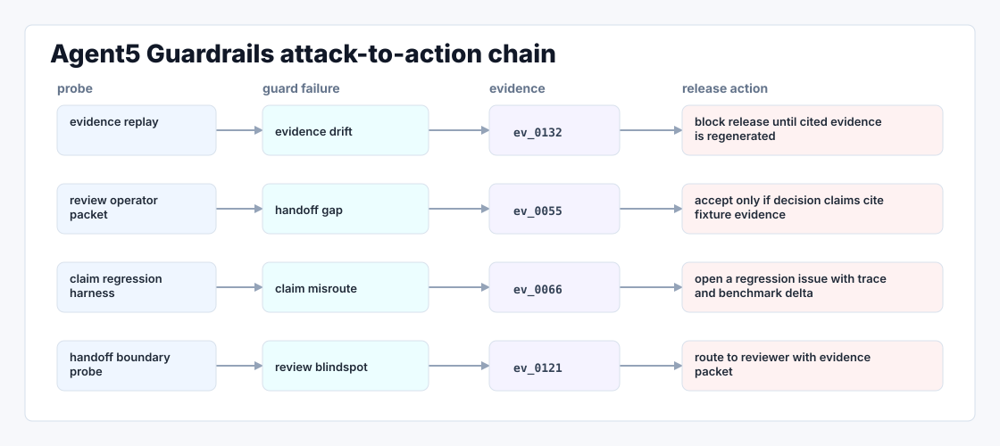

# Agent5 Guardrails

A live evaluation + policy conformance harness that turns Open's webhook stream into an auditable "Agent 5 didn't break the rules this week" dashboard, with zevals compatible regression suites synthesised from real handoffs.



## Why it exists

Open's $7M thesis is "we win regulated enterprise (fintech/healthcare) by resolving L2/L3 issues autonomously" and Agent 5's marketing leans hard on "every decision, every confidence score, every mistake" being visible (agent5).

Most internal demos stop at a pretty chart. This repository is built around the harder part: a repeatable path from fixture, to failure, to evidence, to the operator action a serious team would actually trust.

## What is inside

- A deterministic replay harness tuned around thesis, regulated, and enterprise.
- Company-specific strategy code in `src/agent5_guardrails/strategy.py`, not just README-level customization.
- Citation-locked reports where every decision claim has to point back to a generated evidence ID.
- Two visual artifacts generated from the latest run: `outputs/project_working.svg` and `outputs/evidence_map.svg`.
- A portable demo pack with JSON, CSV, Markdown, HTML, SVG, and benchmark artifacts.



## Signals it measures

- `thesis coverage`
- `regulated risk`
- `enterprise precision`
- `fintech latency`

## Failure modes it plants

- thesis drift
- regulated gap
- enterprise misroute
- fintech blindspot

## Run it locally

```bash
uv sync
uv run agent5-guardrails all
uv run pytest -q
uv run ruff check .
```

## Outputs worth opening

- `outputs/dashboard.html`
- `outputs/project_working.svg`
- `outputs/evidence_map.svg`
- `outputs/operator_brief.md`
- `outputs/decision_report.md`
- `outputs/strategy_model.json`
- `outputs/demo_pack.zip`

## Sources

- https://www.open.cx/agent5
- https://docs.open.cx/introduction
- https://github.com/opencx-labs
- https://github.com/opencx-labs/zevals
- https://github.com/opencx-labs/copilot
- https://wasssl.com/opencx-raises-usd-7-million-to-scale-ai-customer-communication-across-enterprises/
- https://theaiinsider.tech/2025/01/13/open-cx-closes-1-52m-funding-round-to-disrupt-customer-support-with-advanced-ai-solutions/
- https://www.linkedin.com/posts/gharabat_we-have-released-opens-public-apis-likely-activity-7237491696177938433-YCOK
- https://www.linkedin.com/posts/gharabat_introducing-companion-the-agentic-version-activity-7449507043876519936-FW4C

## Boundary

Everything runs locally against synthetic fixtures. There are no credentials, no customer records, no outreach files, and no hosted API dependency.
